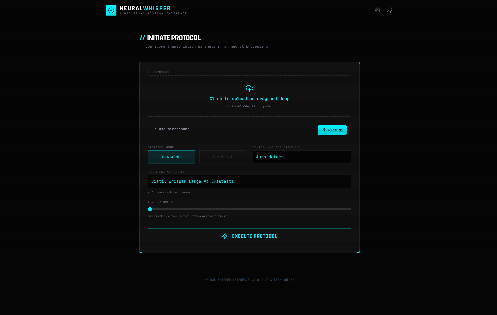

# NeuralWhisper

A sleek, cyberpunk-styled web interface for fast and efficient audio transcription powered by [faster-whisper-server](https://github.com/etalab-ia/faster-whisper-server).

## About

NeuralWhisper provides a modern, intuitive UI for transcribing audio files using OpenAI's Whisper model with the performance optimizations from the Faster Whisper library. It supports multiple languages, speaker diarization, streaming transcription, and maintains a complete history of your transcription tasks.



### Features

- **Fast Transcription**: Powered by faster-whisper for optimized performance
- **Multi-Language Support**: Automatically detect or specify transcription language
- **Speaker Diarization**: Identify and label different speakers in audio
- **Real-time Streaming**: Stream transcription results as they're being processed
- **Task History**: Full history of transcription jobs with results
- **Configurable API**: Easy-to-configure backend API connection
- **Modern UI**: Cyberpunk-themed interface with real-time feedback
- **SEO Optimized**: Fully integrated meta tags, Open Graph support, and custom favicon
- **High Performance**: Optimized with code splitting and lazy loading for faster initial load
- **Export Options**: Copy transcription text directly to clipboard

## Getting Started

### Prerequisites

- Node.js 16+ and npm
- A running [faster-whisper-server](https://github.com/etalab-ia/faster-whisper-server) instance
- Optional: Docker for containerized deployment

### Installation

1. Clone the repository:
```bash
git clone https://github.com/lsj5031/NeuralWhisper.git
cd NeuralWhisper
```

2. Install dependencies:
```bash
npm install
```

3. Start the development server:
```bash
npm run dev
```

The app will be available at `http://localhost:3000`

### Configuration

When you first launch the app, configure the backend server:

1. Click the **Settings** icon (gear) in the top-right corner
2. Enter the **API Base URL** (e.g., `http://localhost:8000` for a local faster-whisper-server)
3. Optionally set an **Admin API Key** if your server requires authentication
4. Click **Save Configuration**

Settings are automatically saved to browser localStorage.

## Usage

### Basic Transcription

1. **Select Audio File**: Click "Choose File" and select an MP3, WAV, or other audio format
2. **Configure Parameters**:
   - **Model**: Select transcription model (tiny, base, small, medium, large)
   - **Language**: Auto-detect or specify a language
   - **Task**: Choose "transcribe" (default) or "translate"
   - **Temperature**: Control transcription randomness (0.0-1.0)
3. **Submit**: Click "Start Transcription"
4. **View Results**: Results appear with language detection and optional speaker labels

### Advanced Features

- **Streaming Mode**: Results stream in real-time as transcription progresses
- **Task History**: All previous transcriptions are saved in the "Processing History" section
- **Delete Tasks**: Remove tasks from history (saved in browser storage)
- **Copy Results**: Quickly copy full transcription text to clipboard

## Development

### Available Scripts

- `npm run dev` - Start development server (port 3000)
- `npm run build` - Build for production (outputs to `dist/`)
- `npm run preview` - Preview production build locally

### Tech Stack

- **Frontend**: React 18, TypeScript, Vite
- **Performance**: React.lazy for code splitting, Suspense for progressive loading
- **Styling**: Tailwind CSS with custom cyberpunk theme
- **API Client**: Fetch API with streaming support
- **Icons**: Lucide React
- **Build Tool**: Vite

### Project Structure

```
NeuralWhisper/
├── components/           # Reusable UI components
│   ├── CyberUI.tsx      # Design system components
│   ├── TranscriptionForm.tsx
│   ├── TaskHistory.tsx
│   └── SettingsModal.tsx
├── services/
│   └── apiService.ts    # API integration
├── App.tsx              # Main app component
├── index.tsx            # Entry point
├── types.ts             # TypeScript interfaces
└── vite.config.ts       # Vite configuration
```

## API Integration

NeuralWhisper communicates with a faster-whisper-server backend via REST API. The server must support:

- `/v1/audio/transcriptions` - POST endpoint for transcription requests
- OpenAI API-compatible response format
- Optional admin key authentication via `x-admin-api-key` header

For more information on the backend server, see [faster-whisper-server](https://github.com/etalab-ia/faster-whisper-server).

## Browser Support

- Chrome/Edge 90+
- Firefox 88+
- Safari 14+
- Modern browsers with ES2020+ support

## Credits

- Built with [faster-whisper-server](https://github.com/etalab-ia/faster-whisper-server) from etalab-ia
- Powered by [faster-whisper](https://github.com/SYSTRAN/faster-whisper)
- Original model from [OpenAI Whisper](https://github.com/openai/whisper)

## License

This project is open source and available under the MIT License.

## Support

For issues related to:
- **NeuralWhisper UI**: [GitHub Issues](https://github.com/lsj5031/NeuralWhisper/issues)
- **faster-whisper-server**: [Upstream Issues](https://github.com/etalab-ia/faster-whisper-server/issues)
- **Faster Whisper**: [SYSTRAN Issues](https://github.com/SYSTRAN/faster-whisper/issues)
